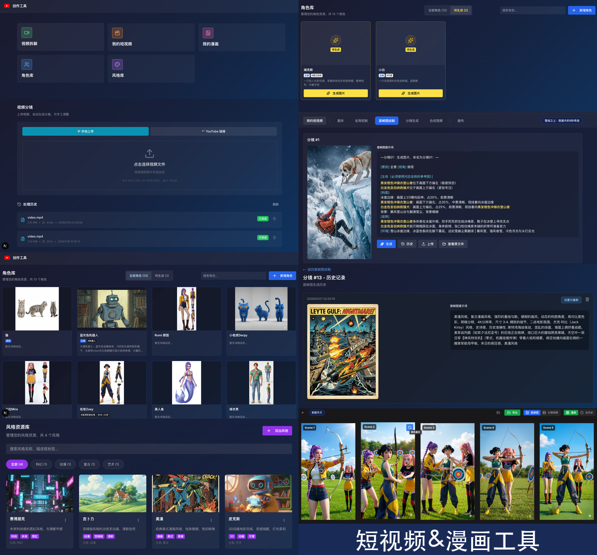

# 短视频&漫画制作工具

基于 Gemini (Nano Banano 和 Veo) 的短视频和漫画创作工具。



## 核心功能

### 🎬 短视频制作
- 视频分镜切割
- 剧本导入（支持 JSON 格式）
- AI 生成首帧图（Nano Banana API, 支持角色参考图保证角色一致性
- AI 生成分镜视频（VEO API）
- 支持上传已有图和视频
- 支持查看所有图和视频以及对应提示词的历史版本
- 分镜视频的合成（如需剪辑，请使用剪映等工具）
- 画布视图，可查看所有历史版本的图和视频
- 支持导出原始图和视频

### 🎨 漫画制作
- 漫画剧本导入
- 分镜图片生成
- 角色一致性管理
- 画布视图，可查看所有历史版本的图
- 其他功能， 同短视频

### 👥 角色管理
- 统一角色库，角色可在多项目复用
- 角色图片生成（Gemini API， 也可外部导入）
- 角色提示词，名称，分类，标签等的管理
- 角色搜索
- 多角色拼接图
- 项目角色关联

### 风格库管理（TODO）
- 风格图片生成
- 风格提示词，名称，分类，标签等的管理
- 风格搜索

## 技术栈

- **后端**: Rust + Actix-web + PostgreSQL
- **前端**: Next.js 15 + TypeScript + TailwindCSS
- **AI 服务**: Gemini API、VEO API
- **图片CDN**: Cloudflare R2 （生成视频时传递首帧图需要用图片CDN链接）

## 快速启动

> 仅支持 macOS

### 0. 安装依赖环境（如已经安装，请忽略）

```bash
# 安装 PostgreSQL
brew install postgresql@15
brew services start postgresql@15

# 安装 Rust
curl --proto '=https' --tlsv1.2 -sSf https://sh.rustup.rs | sh
source $HOME/.cargo/env

# 安装 Node.js (推荐使用 nvm)
brew install nvm
nvm install 20
nvm use 20

# 安装包
cd frontend && npm install
```

### 1. 配置环境变量

复制配置模板并填写实际值：

```bash
cd backend
cp .env.example .env
# 编辑 .env 文件，配置数据库和 API 密钥
```

### 2. 初始化数据库

```bash
createdb video_tools
psql -d video_tools -f backend/schema.sql
```

### 3. 启动服务

```bash
# 一键启动（推荐）
./start.sh

# 或手动启动
cd backend && cargo run --release  # 后端: http://localhost:3001
cd frontend && npm install && npm run dev  # 前端: http://localhost:3000
```

## 项目结构

```
video_tools/
├── backend/              # Rust 后端
│   ├── src/
│   │   ├── main.rs      # 主程序（API 路由和业务逻辑）
│   │   ├── models.rs    # 数据模型
│   │   ├── db.rs        # 数据库连接
│   │   ├── cloudflare.rs # Cloudflare R2 存储
│   │   └── logger.rs    # 日志工具
│   ├── schema.sql       # 数据库 Schema
│   ├── .env.example     # 环境变量模板
│   ├── .env             # 环境变量配置（不提交）
│   └── Cargo.toml       # Rust 依赖配置
├── frontend/            # Next.js 前端
│   ├── app/             # Next.js 15 App Router
│   │   └── workspace/   # 工作区页面
│   │       ├── my-projects/      # 项目列表
│   │       ├── canvas/           # 画布视图
│   │       ├── characters/       # 角色管理
│   │       ├── video-analysis/   # 视频分析
│   │       └── composite-video/  # 视频合成
│   ├── components/      # React 组件
│   ├── lib/             # 工具函数
│   ├── types/           # TypeScript 类型定义
│   └── package.json     # Node 依赖配置
└── start.sh             # 启动脚本
```

## 数据库表
详见 `backend/schema.sql`

## 开发运行

```bash
# 后端开发
cd backend
cargo watch -x run

# 前端开发
cd frontend
npm run dev
```

## License

MIT License
